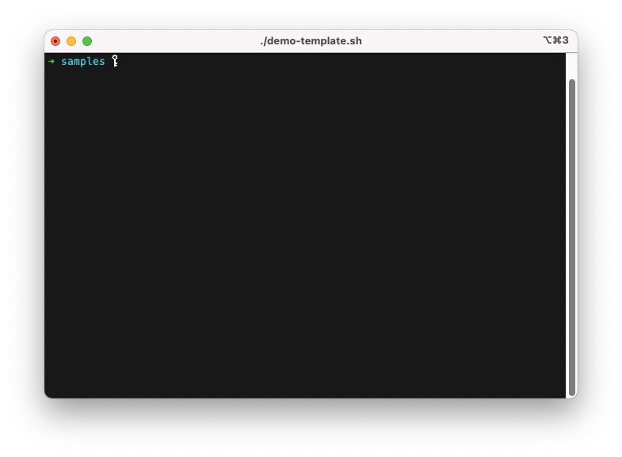
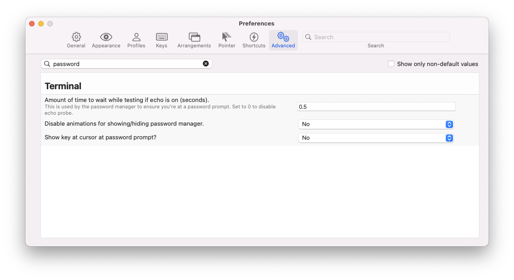

# Demo Magic

demo-magic.sh is a handy shell script that enables you to script repeatable demos in a bash environment so you don't have to type as you present. Rather than trying to type commands when presenting you simply script them and let demo-magic.sh run them for you.

## Features
- Simulates typing. It looks like you are actually typing out commands
- Allows you to actually run commands or pretend to do so.
- Can hide commands from presentation. Useful for behind the scenes stuff that doesn't need to be shown.

## Functions

### pe
Print and Execute.

1. Waits for you to press <kbd>ENTER</kbd> (unless -n is passed).
1. Then simulates typing the command you gave it.
1. Then pauses until you press <kbd>ENTER</kbd>.
1. Then runs the command.

```bash
pe "ls -l"
```

### pei
Print and Execute immediately.

1. Simulates typing the command you gave it.
1. Then runs the command.

```bash
pei "ls -l"
```

### p
Print only.

1. Waits for you to press <kbd>ENTER</kbd> (unless -n is passed).
1. Then simulates typing the command you gave it.
1. Then pauses until you press <kbd>ENTER</kbd>.

```bash
p "ls -l"
```

### wait
Waits for the user to press <kbd>ENTER</kbd>.

If `PROMPT_TIMEOUT` is defined and > 0 the demo will automatically proceed after the amount of seconds has passed.

```bash
# Will wait until user presses enter
PROMPT_TIMEOUT=0
wait

# Will wait max 5 seconds until user presses
PROMPT_TIMEOUT=5
wait
```

### cmd
Enters script into interactive mode and allows newly typed commands to be executed within the script
```bash
cmd
```

### repl
Enters script into repl mode and allows newly typed commands to be executed within the script
Type: `exit` to leave repl mode
```bash
repl
```

## Getting Started
Create a shell script and include demo-magic.sh

```bash
#!/bin/bash

########################
# include the magic
########################
. demo-magic.sh

# hide the evidence
clear

# Put your stuff here
```

Then use the handy functions to run through your demo.

## Handy Starting Points
There are a few samples in the `samples/` folder to show you how easy it is to get up and running.

The `demo-template.sh` is a bit of a showcase of some of the features.

The `remote-exec` folder is there to show you how to run demo-magic locally and on a remote server via ssh. This was created in response to [Issue #24](https://github.com/paxtonhare/demo-magic/issues/24)

## Command line usage
demo-magic.sh exposes some options to your script.
- `-d` - disable simulated typing. Useful for debugging
- `-h` - prints the usage text
- `-n` - set no default waiting after `p` and `pe` functions
- `-w` - set no wait timeout after `p` and `pe` functions

```bash
$ ./my-demo.sh -h

Usage: ./my-demo.sh [options]

  Where options is one or more of:
  -h  Prints Help text
  -d  Debug mode. Disables simulated typing
  -n  No wait
  -w  Waits max the given amount of seconds before proceeding with demo (e.g. `-w5`)
```

## Useful Tricks

### Faking network connections
Network connections during demos are often unreliable. Try and fake whatever commands would rely on a network connection. For example: Instead of trying to install node modules in a node.js application you can fake it. You can install the node_modules at home on your decent network. Then rename the directory and pretend to install it later by symlinking. If you want to be thorough you can capture the output of npm install into a log file then cat it out later to simulate the install.

```bash
#!/bin/bash

########################
# include the magic
########################
. demo-magic.sh

# hide the evidence
clear

# this command is typed and executed
pe "cd my-app"

# this command is merely typed. Not executed
p "npm install"

# this command runs behind the scenes
ln -s cached_node_modules node_modules

# cat out a log file that captures a previous successful node modules install
cat node-modules-install.log

# now type and run the command to start your app
pe "node index.js"
```

### No waiting
The -n _no wait_ option can be useful if you want to print and execute multiple commands.

```bash
# include demo-magic
. demo-magic.sh -n

# add multiple commands
pe 'git status'
pe 'git log --oneline --decorate -n 20'
```

However this will oblige you to define your waiting points manually e.g.
```bash
...
# define waiting points
pe 'git status'
pe 'git log --oneline --decorate -n 20'
wait
pe 'git pull'
pe 'git log --oneline --decorate -n 20'
wait
```

### Pesky key cursor

Some terminals (Mac terminal, [iterm2](https://iterm2.com/)) display a key cursor when input is masked.



You can turn this off in [iterm2](https://iterm2.com/) like so:


